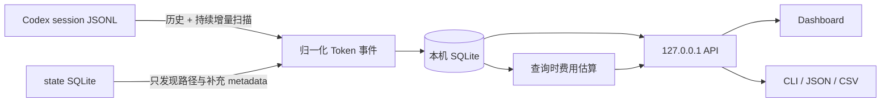

<div align="center">


<h1 align="center">Codex Usage<sub><sub><p align="right"><sup>by zJay</sup></p></sub></sub></h1>

**让 Codex 用量一目了然。**

*完整、顺手的本地用量仪表盘，从每台电脑到每一次任务。*

[在线体验](https://zjay26.github.io/codex-usage/?lang=zh-CN) · [Windows x64](https://github.com/zJay26/codex-usage/releases/latest/download/codex-usage-windows-amd64.exe) · [Linux x64](https://github.com/zJay26/codex-usage/releases/latest/download/codex-usage-linux-amd64) · [macOS Apple Silicon](https://github.com/zJay26/codex-usage/releases/latest/download/codex-usage-darwin-arm64) · [全部下载](#直接安装) · [English](README.en.md) / 简体中文

[](https://github.com/zJay26/codex-usage/actions/workflows/ci.yml)
[](https://github.com/zJay26/codex-usage/releases/latest)
[](https://go.dev/)
[](LICENSE)

</div>


概览 → 分钟级时间查询 → 小时下钻 → 每日月历 → 项目与任务树 → 搜索与 Fast 筛选 → JSON / CSV 导出 → 模型定价 → 明暗主题与中英切换。

[亲手试用在线 Demo](https://zjay26.github.io/codex-usage/?lang=zh-CN) · [高清演示视频](docs/media/codex-usage-demo-zh.mp4)

> 演示使用完整定价、无异常记录的合成数据，直接录制当前 Dashboard。在线 Demo 不读取你的文件、不设 Cookie、无埋点或外部请求。

## 从总览到每一次任务

**codex-usage 是为日常高频使用 Codex 打磨的完整本地用量统计工具。** 总量、趋势、费用、模型、项目和任务明细集中在一个清晰的 Dashboard：先看全貌，再顺着日期、小时、模型或任务找到消耗来源。单台电脑用起来完整顺手，多台电脑使用同一账号时，逐电脑统计又能让每台主机的用量各自清楚。

安装一次，历史记录自动整理，后续用量持续更新。**从“今天用了多少”到“这 90 分钟、这个项目、这棵子任务树花了多少”，都能在同一个界面里查清。** 常规 / Fast 拆分、精确到分钟的时间范围、Session 搜索、组合筛选、API 等价费用和数据导出一应俱全；中英双语、明暗主题、显示设置与手机布局让日常查看同样舒服。

Windows、Linux / WSL、macOS 均可使用，一个程序即可安装，无需部署数据库或中心服务器。统计留在当前电脑；展开轮详情时才读取原始日志中的公开 prompt、回复及工具记录，不把正文写入 SQLite 或导出，也不读取 `auth.json`。API 等价美元与 Codex credits 分别估算，均非真实账单或账号配额。

## 本 fork：聊天 → 轮 → 调用

列表中的「查看轮次与调用」打开独立弹窗，用嵌套卡片查看聊天、每轮和有独立 `response_id` 的模型调用。轮详情按需读取公开用户输入、助手输出及工具请求与结果；旧式 `token_count` 只有轮级用量时会明确提示调用明细不可用。混合模型轮列出所有已确认模型，未知身份或费率保持未确认。每个聊天可通过「在 Codex 打开」回到对应对话。

详情用固定四色条显示缓存输入、非缓存输入、推理输出、直接输出；悬浮、聚焦或点击色带可查看上下级占比。缓存写入归入非缓存输入，同时在数字详情单列。推理输出属于总输出，不重复计价。定价对话框可配置模型 API 单价及带生效日期的 Codex credits 费率；内置目录是当前版本的价格快照，历史估算可能需要补充当时费率。正文仅从本机原始 JSONL 按需读取，统计库和用量导出不包含正文。

开发运行：`go run ./cmd/codex-usage serve`。服务默认绑定 `127.0.0.1:43189`，可通过 `CODEX_USAGE_HOME` 指向独立状态目录。Stop hook 可在全局 `~/.codex/hooks.json` 中使用以下命令，程序在本地服务运行时增量扫描，服务离线时正常结束；定期扫描仍会补齐漏触发的记录：

```json
{"hooks":{"Stop":[{"hooks":[{"type":"command","command":"<absolute-path-to-codex-usage> hook-stop --state-dir <absolute-state-dir>","timeout":10}]}]}}
```

本 fork 的代码按 [Conversation](internal/conversation/README.md)、[Pricing](internal/pricing/README.md)、[Dashboard](internal/dashboard/README.md) 管理；`cmd/` 装配入口。API：`GET /api/v1/ledger?thread_id=...` 返回三级用量；加 `turn_id` 与 `offset`、`limit` 按需读取公开正文；`GET/PUT /api/v1/pricing/credits` 管理生效日期费率；`POST /api/v1/hook/stop` 接收 `session_id`、`turn_id`。

## 直接安装

本文对应稳定版 **[v2.7.1](https://github.com/zJay26/codex-usage/releases/tag/v2.7.1)**；变更和升级边界见 [发布说明](docs/releases/v2.7.1.md)。以下下载链接始终指向最新稳定版。

| 系统 | amd64 / x64 | arm64 |
|---|---|---|
| Windows | [x64 程序](https://github.com/zJay26/codex-usage/releases/latest/download/codex-usage-windows-amd64.exe) | [ARM64 程序](https://github.com/zJay26/codex-usage/releases/latest/download/codex-usage-windows-arm64.exe) |
| Linux / WSL | [x64 程序](https://github.com/zJay26/codex-usage/releases/latest/download/codex-usage-linux-amd64) | [ARM64 程序](https://github.com/zJay26/codex-usage/releases/latest/download/codex-usage-linux-arm64) |
| macOS | [Intel 程序](https://github.com/zJay26/codex-usage/releases/latest/download/codex-usage-darwin-amd64) | [Apple Silicon 程序](https://github.com/zJay26/codex-usage/releases/latest/download/codex-usage-darwin-arm64) |

### Windows

amd64 / x64，无需管理员权限；ARM64 设备将下载地址中的 `amd64` 改为 `arm64`：

```powershell
Invoke-WebRequest https://github.com/zJay26/codex-usage/releases/latest/download/codex-usage-windows-amd64.exe -OutFile codex-usage.exe
.\codex-usage.exe install
```

### Linux / WSL

amd64 / x64；ARM64 设备将下载地址中的 `amd64` 改为 `arm64`：

```bash
curl -fL https://github.com/zJay26/codex-usage/releases/latest/download/codex-usage-linux-amd64 -o codex-usage
chmod +x codex-usage
./codex-usage install
```

默认使用 `systemd --user` 登录自启；user bus 不可用时会尝试后台启动并给出提示，需要自行完成自启配置。

### macOS

Apple Silicon；Intel 设备将下载地址中的 `arm64` 改为 `amd64`：

```bash
curl -fL https://github.com/zJay26/codex-usage/releases/latest/download/codex-usage-darwin-arm64 -o codex-usage
chmod +x codex-usage
./codex-usage install
```

请在 macOS 图形登录会话中安装，通过用户 LaunchAgent 登录自启，无需 `sudo`。程序未经 Apple Developer ID 签名或公证；校验和打开方式见 [macOS 安装说明](docs/macos.md)。仅有 SSH 会话时可用 `./codex-usage serve` 前台运行。

### 校验与打开 Dashboard

每个 Release 附带 [SHA256SUMS](https://github.com/zJay26/codex-usage/releases/latest/download/SHA256SUMS)。可在执行下载的程序前，用 Windows 的 `Get-FileHash .\codex-usage.exe -Algorithm SHA256`、Linux 的 `sha256sum codex-usage` 或 macOS 的 `shasum -a 256 codex-usage` 计算哈希，与清单中对应系统和架构的完整文件名核对。

安装器会整理本机已有记录并启动后台服务。之后访问安装输出中的 Dashboard 地址，默认是 [http://127.0.0.1:43189](http://127.0.0.1:43189)。也可运行已安装的程序打开浏览器；默认路径下的命令如下：

| 系统 | 打开 Dashboard |
|---|---|
| Windows PowerShell | `& "$env:LOCALAPPDATA\Programs\codex-usage\codex-usage.exe"` |
| Linux / WSL | `"$HOME/.local/bin/codex-usage"` |
| macOS | `"$HOME/Library/Application Support/codex-usage/bin/codex-usage"` |

安装器不会修改 `PATH`。设置过 `CODEX_USAGE_HOME` 时，以安装输出的程序路径为准。Linux 服务器没有桌面环境时，程序会打印 SSH 隧道命令；在自己的电脑执行后再打开 Dashboard。

### 升级现有安装

从 **v2.5.0** 起，程序默认每 6 小时检查一次 GitHub 最新稳定版，只提示、不强制更新。页面底部的“软件更新”可查看发布说明、关闭自动检查或手动检查；点击“下载并更新”后才下载并校验 SHA256、备份程序和本机统计、替换并重启。新版本启动失败会尝试恢复旧程序和数据，备份保留在状态目录的 `.codex-usage-updates/run-*` 中。

**已安装 v2.5.0 或更高版本，可直接在软件内选择升级；早于 v2.5.0 的版本需先手动下载并执行 `install`。** 便携版和预览版只提供检查和发布页链接。更新检查只向 GitHub 请求版本信息，下载也来自本项目 Release，不上传用量、路径或对话；关闭自动检查后不会在后台请求更新信息。仍可随时通过重新执行 `install` 手动升级。

“软件更新”中可以设置**更新包下载目录**，并打开文件夹或复制路径。默认保存到用户下载目录下的 `codex-usage` 文件夹；版本文件夹内保留正式安装包，界面显示最近下载的完整路径。保存新目录只影响后续下载，已有文件留在原处；数据库备份仍保留在本机状态目录。

**v2.6.4 修复压缩请求漏计，保留 v2.6.3 的混合累计修复。** 旧版统计库升级到 schema v11 后，已有统计会保留并标记为需要核对，增量扫描暂停。先备份并确认源 JSONL 仍齐全，再点击“重新扫描”并选择“同意并重建”，或显式执行 `codex-usage scan --rebuild`，修正历史用量。源文件已删除的历史无法由重建恢复；只升级程序不会自动修正旧账。

## 为日常使用打磨的完整功能

| 功能 | 你得到什么 |
|---|---|
| 一眼看清总量与费用 | 总 Token、Input / Cached / Cache Write / Output / Reasoning 构成、API 等价成本与定价覆盖率集中展示 |
| 自定义时间查询 | 今天、7 日、30 日、全部历史，或精确到分钟的任意起止范围；跨天查询并显示未经缩写的精确总量 |
| 常规 / Fast 拆分 | 总览、趋势、模型和任务展示总量与 Fast；可只看 Fast 消耗，并按支持模型的额度倍率折算费用 |
| 每日与小时下钻 | 连续趋势、月历、零用量日、小时分布与模型组成；远程浏览器遵循统一计量时区，正确区分夏令时重复小时 |
| 多维用量归属 | 按模型、来源、项目、Thread、Session，以及主任务、Subagent、Guardian、Memory 理解消耗 |
| 主任务与子任务树 | 折叠查看明确父子关系，区分本任务与含子任务用量；费用列仅计本任务 |
| 搜索、筛选与导出 | 搜索任务标题、Session ID、项目、模型或来源，组合日期 / 模式 / Agent 等筛选，一键导出当前范围的 JSON / CSV |
| 可配置的模型定价 | 内置 GPT-6 Astra / Sol / Luna 等模型价格，支持内部模型映射和本机单价覆写；无法定价的部分明确标出 |
| 顺手的界面 | 中英双语、明暗主题、字体与密度设置、减少动态效果、手机适配；统计与费用始终跟随同一筛选范围 |
| 逐电脑独立统计 | 公司电脑、家用电脑及 Windows / WSL / Linux / macOS 主机分别查看，定位各自的消耗 |
| 持续更新与数据核对 | 自动整理历史并增量扫描；识别重复、fork 重放和压缩请求，需要重建时保留统计并请求确认 |
| 轻量安装与软件更新 | 六种平台 / 架构的单文件程序，无需外置数据库；可选自动检查新版本，由用户选择下载安装 |
| 本地与隐私 | 数据留在当前电脑，页面资源离线内嵌，不上传用量或对话，不依赖中心服务器 |

## 范围与边界

| 会统计 | 不会统计或保存 |
|---|---|
| 当前电脑的 Token、模型、来源、项目、Thread、Session、Agent 和自然日 | 账号在其他电脑上的用量 |
| 本机已有以及之后新增的 Codex session 用量记录 | 账号配额、订阅余额或真实账单 |
| 分开的 API 等价美元与 Codex credits 估算、定价覆盖率 | 真实账单、账号额度、reasoning 正文或 `auth.json` |
| 重复、回退、坏记录和文件重建等数据质量提示 | 云同步、远程遥测或第三方分析 |

> “电脑”指运行 Codex 客户端和 codex-usage 的主机，不是 shell 或 tool 实际执行的远程环境。Codex 官方 `/usage` 查看账号级活动；codex-usage 补充当前电脑上的详细归属。

<details><summary>查看当前桌面与手机界面（合成数据）</summary>


</details>

## 工作原理与技术说明

`codex-usage` 是一个 Go 单文件程序，里面同时包含 JSONL 扫描器、SQLite、HTTP API 和 Web Dashboard。安装后，它以用户级后台服务运行。

升级时，安装器只会移除旧版由 codex-usage 自己标记的 OTel exporter，不会改写第三方 exporter，也无需重启 Codex。



### 1. 历史扫描

程序只读当前电脑的 `CODEX_HOME`。它优先从 Codex 状态库取得 session 路径、项目和 Thread 信息，再流式读取 `sessions/` 与 `archived_sessions/` 中的 JSONL。

新格式日志优先读取 `token_usage_record`，按线程与 `response_id` 去重，并用 `turn_token_usage` 核对已入账增量，普通响应和压缩请求均计入。同一 Turn 的旧 `token_count` 通知只更新旧格式游标，不再重复加账；压缩历史中内嵌的同一请求也不会再次计数。缺少独立明细时，累计补足的时间归属会标为不确定；出现无法匹配的旧通知会提示可能缺少尾部用量。

没有独立请求记录的旧 Turn 继续使用累计差分：新 Turn 的 `total_token_usage` 与 `last_token_usage` 相等时重新起算，连续累计或重发旧快照时保留原基线，一次重置不会决定所有后续 Turn。用量归到记录时间戳对应的计量自然日，不会按 Session 最后更新时间归入同一天。无法确定边界时保留不完整提示；未记录实际用量的旧压缩无法凭上下文长度补算。重复扫描通过请求身份、稳定事件 ID 和游标去重，超大的 prompt、回复和工具输出被跳过且不写入数据库。

Codex 状态库只用于发现 rollout 路径并补充标题、项目等 metadata；其中的 `tokens_used` 不参与 Token 总量。OpenAI 的 [`account/usage/read`](https://learn.chatgpt.com/docs/app-server#7-token-usage-chatgpt) 是服务端账号 Token 活动；本工具只统计当前电脑的本地 JSONL，两者范围不同。

### 2. JSONL 防重与 fork 识别

- 一个物理 JSONL 的 owner session 由第一条 `session_meta` 固定，后续复制进来的父 `session_meta` 不会改写归属
- fork 文件中复制的父线程历史只建立累计基线，不计作子线程新消耗；兼容父 metadata 出现在历史之前或之后的格式，以及仅有一条 metadata 的格式，按对应证据识别子线程开始边界
- Session 范围保留累计高水位；Turn 范围保存每个 Turn 的累计进度并按稳定快照标识排重，重启或从复制文件的 Turn 中途恢复时仅计新增部分。升级前 Session 出现在新的物理文件、旧标识无法安全核对时保留统计并提示重建
- `total_tokens` 不变但 Cached Input、Cache Write、Reasoning 等分类被修正时，会修正原事件，而不是当作重复忽略

### 3. 文件与日期稳定性

扫描器每次都用状态库路径与 `sessions/`、`archived_sessions/` 目录取并集，避免状态库漏行。Windows 普通路径与 `\\?\` 扩展路径会归一为同一物理文件。检测到截断、原范围重写、后补出的 fork 重放边界或解析规则升级时，程序会保留现有统计并提示需要重建；只有用户在 Dashboard 明确确认，或显式运行 `codex-usage scan --rebuild` 后，才会清除派生索引并从当前仍存在的全部 JSONL 重建。已删除 JSONL 对应的数据届时可能无法恢复。

计量时区以 IANA 名称保存在数据库，所有进程与远程浏览器使用同一时区；页脚显示当前时区。首次由 v2.6 系列打开尚未保存时区的库时，会采用 `CODEX_USAGE_TIMEZONE`（例如 `Asia/Shanghai`），未设置则检测主机时区；之后更改系统或进程时区不会覆盖已保存的值。升级保留原有自然日标签，新增事件使用保存的计量时区。小时用真实 UTC 起点标识，夏令时重复小时不会合并，一天可以有 23 或 25 小时。无法完整核对的累计边界、坏记录、无效时间戳和待确认重建会明确提示；文件改写或截断问题经后续扫描确认恢复后，过时的红色提示会自动消除。

事件、模式、累计进度与文件游标按文件原子提交；写入失败整笔回滚并保留重试位置。未完整写入的 JSONL 尾行不会提前消费，包括尚未写到 `type` 字段的前缀。

**升级不会自动重算旧账。** 历史保留、计量规则和回归验证见 [v2.6 技术说明](docs/accounting-v2.6.md)。

### 4. 展示与服务

后台服务启动时先扫描一次，之后每 30 秒只检查 JSONL 的文件大小与修改时间；检测到变化才执行增量扫描，无变化时每 10 分钟兜底扫描。Dashboard 使用独立只读连接查询同一个本机 SQLite，扫描写入不会再把页面查询堵在单一连接后。没有任何中心服务器，也没有跨电脑同步；要看两台电脑，就分别打开两台电脑的 Dashboard。

Dashboard 固定为“概览 / 每日 / 明细”三个一级视图。概览默认显示最近 7 个计量自然日；每日视图补齐零用量日期并支持月历与小时下钻；明细视图提供模型、来源、Agent、项目、Thread 等维度，以及 Session 列表／任务树切换。

在概览选择“自定义”，输入精确到分钟的开始、结束时间，再点击“查询用量”，即可查看区间内的总 Token、精确总量及 API 等价成本。“现在”将结束时间填为当前分钟，点击查询后生效。输入按页脚的计量时区解释，统计包含开始时刻、不包含结束时刻；修改输入后，下方仍保留上次查询结果，直到再次查询。夏令时重复分钟取首次出现，不存在的分钟会报错。API 的 `since` / `until` 同时支持 `YYYY-MM-DDTHH:mm`（计量时区）和带偏移的 RFC3339；费用接口可用 `fill_days=0` 跳过零用量日补齐，以查询任意跨度。

任务树只使用 JSONL 或 Codex 状态库中明确的父子元数据，fork 来源单独显示。分页按根任务进行，子任务跟随父任务；筛选范围外的祖先仅用于展示结构，不增加用量。每行 Token 与费用属于本任务，“含子任务”的 Token 合计覆盖当前筛选范围内的整个子树；不要把每一行子树合计再次相加。缺失父任务或循环关系会作为独立根节点显示并标注。

查询使用持久化的数据版本和 SQLite 读取快照，让 Session 行与费用来自同一版数据；外部定价配置变更也会使缓存失效。搜索先确定匹配的 Session，再统一应用日期、模型、模式等筛选到 Token、费用和导出。Session 查询先选页内任务并聚合其事件，再关联元数据；测量方法和本机延迟对比见 [查询一致性与性能](docs/accounting-v2.6.md#query-consistency-and-performance)。

页头“显示设置”默认采用更舒适的字号层级，并可即时调整字体大小、显示密度、颜色主题、界面动效和语言。所有显示偏好只保存在当前浏览器，不会影响统计数据或导出结果。

### 5. API 等价成本

Dashboard 展示常规、Fast 和全部 token，并提供模式筛选。Fast 原始 token 不乘倍率；API 等价美元按 API 费率估算，Codex credits 按 credits 费率及有证据的 Fast 倍率估算。历史模式仅凭同一 turn 的明确证据补齐，未确认部分暂归常规。显式请求旧版 `codex_fast_weighted` 查询参数仍可查看历史折算口径；日常面板不将其当作 API 账单。详见 [Fast 模式口径、历史补齐与接口说明](docs/fast-mode-accounting.md)。

费用在查询时流式读取已经过去重、归属规则筛选后的规范事件，不写入 SQLite，也不会改变原有 Token 统计。计算使用定点 nano-USD：Cached Input 与 Cache Write 从 Input 中扣除，Reasoning 已包含在 Output 中，不会重复收费。

内置 Standard 文本价格目录更新于 **2026-09-23**，单位均为 USD / 1M Token：

| 模型 | Input | Cached | Cache Write | Output |
|---|---:|---:|---:|---:|
| [GPT-6 Astra](https://developers.openai.com/api/docs/models/gpt-6-astra) | 10.00 | 1.00 | 12.50 | 50.00 |
| [GPT-6 Sol](https://developers.openai.com/api/docs/models/gpt-6-sol) | 2.00 | 0.20 | 2.50 | 10.00 |
| [GPT-6 Luna](https://developers.openai.com/api/docs/models/gpt-6-luna) | 0.10 | 0.01 | 0.125 | 0.50 |
| [GPT-5.6 Sol](https://developers.openai.com/api/docs/models/gpt-5.6-sol) | 5.00 | 0.50 | 6.25 | 30.00 |
| [GPT-5.6 Terra](https://developers.openai.com/api/docs/models/gpt-5.6-terra) | 2.00 | 0.20 | 2.50 | 12.00 |
| [GPT-5.6 Luna](https://developers.openai.com/api/docs/models/gpt-5.6-luna) | 0.20 | 0.02 | 0.25 | 1.20 |
| [GPT-5.5](https://developers.openai.com/api/docs/models/gpt-5.5) | 5.00 | 0.50 | 未公开 | 30.00 |
| [GPT-5.4](https://developers.openai.com/api/docs/models/gpt-5.4) | 2.50 | 0.25 | 未公开 | 15.00 |
| [GPT-5.4 mini](https://developers.openai.com/api/docs/models/gpt-5.4-mini) | 0.75 | 0.075 | 未公开 | 4.50 |
| [GPT-5.3-Codex](https://developers.openai.com/api/docs/models/gpt-5.3-codex) | 1.75 | 0.175 | 未公开 | 14.00 |
| [GPT-5.2-Codex](https://developers.openai.com/api/docs/models/gpt-5.2-codex) | 1.75 | 0.175 | 未公开 | 14.00 |

GPT-6 Astra/Sol/Luna 和 GPT-5.6 的 Cache Write 使用官方“普通 Input 的 1.25 倍”规则。本机 JSONL 保存的是累计 Token 活动，不能可靠还原 API 账单中的逐请求边界；估算采用上表 Standard 基价，并对明确 Fast 的用量折算，不推断长上下文倍率。页面始终同时展示费用和 Token 定价覆盖率，未知模型不会被当成零费用。

内部模型可以在 Dashboard 的“定价设置”中映射到一个明确的内置公开模型，或填写自定义单价。等价配置如下，保存后无需重启：

```json
{
  "pricing_overrides": {
    "codex-auto-review": { "alias_of": "gpt-5.6-luna" },
    "internal-model": {
      "input_usd_per_million": "1.00",
      "cached_input_usd_per_million": "0.10",
      "cache_write_input_usd_per_million": "1.25",
      "output_usd_per_million": "6.00"
    }
  }
}
```

本机 API 提供 `GET /api/v1/sessions`、`GET /api/v1/session-tree`、`GET /api/v1/session-estimates`、`GET /api/v1/cost-estimate`、`GET /api/v1/pricing` 和 `PUT /api/v1/pricing/overrides`。价格随二进制嵌入，运行时不会抓取网页。

## 常用命令

以下用 `codex-usage` 简写已加入 `PATH` 的程序；否则请使用上方对应系统的完整调用路径，再追加参数。CLI 输出可在命令前加全局参数切换语言，例如 `codex-usage --lang en doctor`。

```text
codex-usage                         打开 Dashboard
codex-usage summary --since 7d     查看近 7 日摘要
codex-usage summary --since 30d --json
codex-usage summary --since all --csv
codex-usage scan                    增量扫描
codex-usage scan --rebuild          重建历史扫描数据
codex-usage serve                   前台运行本机服务
codex-usage doctor                  检查路径、JSONL 来源和服务
codex-usage config add-home PATH    添加额外 CODEX_HOME
codex-usage uninstall               卸载程序，保留统计库
codex-usage uninstall --purge       卸载并删除统计数据
```

Dashboard 支持 `?lang=en|zh-CN` 和页头语言按钮；URL 参数优先于已保存语言，其次跟随浏览器。CLI 也支持 `CODEX_USAGE_LANG` 环境变量。`--json` 与 `--csv` 字段不随语言改变。

## 数据存在哪里

| 内容 | Windows | Linux | macOS |
|---|---|---|---|
| Codex Home | `%USERPROFILE%\.codex` | `~/.codex` | `~/.codex` |
| codex-usage 状态 | `%LOCALAPPDATA%\codex-usage` | `${XDG_DATA_HOME:-~/.local/share}/codex-usage` | `~/Library/Application Support/codex-usage` |
| 安装后的程序 | `%LOCALAPPDATA%\Programs\codex-usage\codex-usage.exe` | `~/.local/bin/codex-usage` | `~/Library/Application Support/codex-usage/bin/codex-usage` |
| SQLite | 状态目录下的 `usage.sqlite` | 状态目录下的 `usage.sqlite` | 状态目录下的 `usage.sqlite` |

`CODEX_HOME` 选择要读取的 Codex 源目录；`CODEX_USAGE_HOME` 选择工具自己的专用状态目录，并将程序安装到该目录的 `bin` 下。二者用途不同。Windows 和 WSL 应分别使用自己的统计库；不要跨系统或跨电脑共享、同步活动状态目录，否则逐电脑边界会失真。

macOS 登录项位于 `~/Library/LaunchAgents/com.zjay.codex-usage.plist`。`uninstall` 会卸载服务和程序、保留统计；只有 `uninstall --purge` 才会同时删除工具的统计数据。

`usage.sqlite` 会在首次安装、启动服务、扫描或查询需要打开状态库时自动创建，并持续保存在上述状态目录。程序使用内嵌的纯 Go SQLite 驱动，不要求预装 SQLite、数据库服务、Python、Docker 或 CGO；只需要当前用户对状态目录有读写权限，并有足够磁盘空间。应优先使用本机磁盘，不建议把活动数据库放在网盘、网络共享或多台电脑共同写入的同步目录。

## 隐私边界

`codex-usage` 的边界是刻意收紧的：

- 不读取或解析 `auth.json`
- 展开轮详情时按需读取原始 JSONL 的公开 prompt、回复及工具记录；不把正文存入统计库或用量导出，也不展示 reasoning 正文
- 不保存 Codex 账号 ID
- 不使用 CDN，页面资源全部离线内嵌
- 不监听 `127.0.0.1` 以外的地址
- 不读取 OpenAI 真实账单或 ChatGPT rate-limit / 账号配额；只提供当前电脑的 API 等价成本估算（含 Fast 折算）
- 定价目录随二进制嵌入，运行时不会为费用功能访问外部网络

本机完整项目路径和 Thread 标题会用于归属视图，因此导出的 JSON/CSV 也可能包含这些本机信息。

## 从源码构建

需要 Go 1.26.x；CI 和正式 Release 使用 **Go 1.26.8**。Linux / macOS 构建当前平台：

```bash
go test ./...
CGO_ENABLED=0 go build -trimpath -o codex-usage ./cmd/codex-usage
```

构建全部平台：

```powershell
# Windows
.\scripts\build.ps1
```

```bash
# Linux（脚本使用 sha256sum）
bash scripts/build.sh
```

两个脚本都会运行 Go 测试，生成六个平台程序及 `dist/SHA256SUMS`。macOS 可按上方命令构建本机程序，或在提供 GNU `sha256sum` 的环境中使用 Bash 脚本交叉构建。

Dashboard 测试（需要 Node.js / npm；CI 使用 Node.js 24）：

```bash
npm ci
npx playwright install chromium
npm test
```

`npm test` 默认在临时目录构建并启动真实 Go 二进制；设置 `CODEX_USAGE_BIN` 可以复用已有构建产物。

README 动图、视频和截图可通过 `npm run capture:media` 重新生成；依赖、演示场景与录制检查见 [媒体说明](docs/media/README.md)。

当前 [CI](https://github.com/zJay26/codex-usage/actions/workflows/ci.yml) 覆盖 Windows、Linux、macOS Apple Silicon / Intel 的 Go 测试与 vet、Linux 并发检查、六目标交叉构建及 Dashboard 测试；两个 macOS 架构还各执行三轮安装、卸载和重装。Release 发布也要求原生 macOS 检查通过。

v2.6 的计量回归、任务树、远程时区图表与性能证据见 [技术与验证说明](docs/accounting-v2.6.md)；旧版本验收记录归档于 [ACCEPTANCE.md](ACCEPTANCE.md)。问题反馈前请阅读 [CONTRIBUTING.md](CONTRIBUTING.md)；涉及本机数据或路径的安全问题请按 [SECURITY.md](SECURITY.md) 私密报告。

## 已知边界

- 当前版本不做跨电脑聚合；每台机器独立查看
- JSONL 若被外部工具永久删除或损坏，缺失部分无法由 state `tokens_used` 或账号用量伪造补回
- 主动同步同一个 Codex Home 后，安装前的历史无法可靠拆回原始电脑
- `total` 按 Codex 原始值展示，不等于独立生成文字量、真实账单或账号配额；API 等价成本按当前内置目录及本机定价设置对 Token 重新折算，价格不会在线自动同步

## License

[MIT](LICENSE) © Codex Usage contributors
